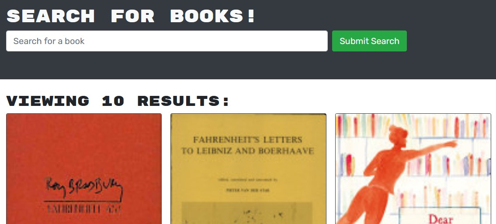

# Google Book Search

 

## Description
This project is a book search using Google Books API that allows users to search for books, create an account, and save books to their account. The project utilizes a MERN stack, with a React front end, MongoDB database, and Node.js/Express server and API.  

## Available Scripts
The project uses both a back and front end server. The servers can be run separately or use npm start from the root directory. 

## Questions/Comments
Any questions or feedback regarding this project can be sent directly to my [email](mailto:jason.barnes@humboldt.edu). This project and others can be found at my [Github page]('https://github.com/yooperjb').